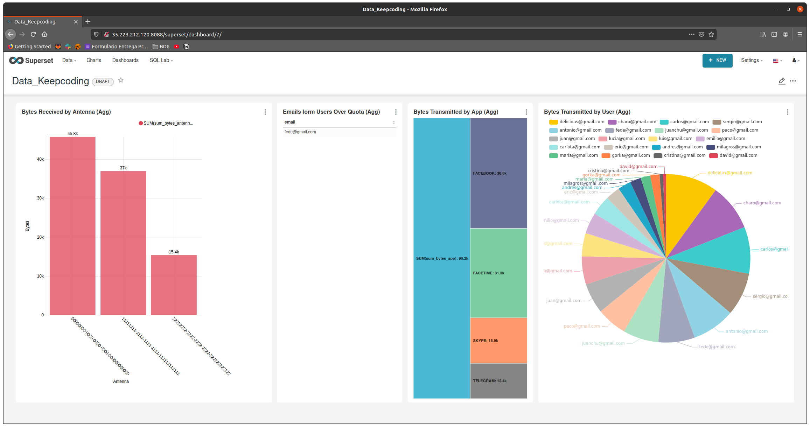

# Keepcoding: Big Data Processing
I have developed a system that matches [these requirements](Guides/wwwh.md).

If you already know how this works, you can go directly to [the conclusions](#conclusions)

For that reason I've separated the project into three different packages:
1. streaming
2. batch
3. serving

## Provisioner
In order to proceed with the initial setup, I've created a *Provisioner* object to help out with this step.

#### Database
You only need to add your own `IpServer` (previously you must provision a PostgreSQL database there) and run the provisioner, which will create the needed tables as well as populate some initial values.

#### Docker
Apart from the initial provisioning on the database, you must run the demo-script our magnificent teacher had prepared in order to send real-time information to our kafka server:
``docker run -it -e KAFKA_SERVERS=${INSTANCE_PUBLIC_IP}:9092 andresgomezfrr/data-simulator:1.1``

## Speed Layer
### Streaming Package
This package contains both the `StreamingJob` file, as well as its implementation.

The Speed Layer will match live information coming from Kafka with stored information on a PostgreSQL database to enrich a dataset, and process this computed data to store them back both to another Postgres tables as well as in *Parquet* (segregated by **year**, **month**, **day** and **hour**).

You need to provide the following arguments while running **StreamingJob**:
``KAFKA_SERVER:9092 devices jdbc:postgresql://IpServer:5432/postgres bytes_by_antenna_agg bytes_by_user_agg bytes_by_app_agg user_metadata JDBC_USER JDBC_PASS PARQUET_STORAGE_PATH``

## Batch Layer
### Batch Package
This package contains both the `BatchJob` file, as well as its implementation.

The Batch Layer will read the *Parquet* information (filtered by the date provided in the arguments) and process de data to finally store the results in Postgres.

You need to provide the following arguments while running **BatchJob**:
``YEAR MONTH DAY HOUR PARQUET_STORAGE_PATH jdbc:postgresql://IpServer:5432/postgres JDBC_USER JDBC_PASS batch_bytes_by_antenna_agg batch_bytes_by_user_agg batch_bytes_by_app_agg batch_over_quota_agg``

## Serving Layer
### Dataset

The Serving Layer it's composed by the previous information generated by the other two layers and stored in Postgres, from which *Apache Dataset* will read the information and show it on a Dashboard with multiple Charts (one per dataset).

#  Conclusions

### What have I leaned?
* I've understood the different concepts on how to treat and process data (lively on a kafka stream, or batched from database).
* Grow my knowledge in Scala and Spark.
* Working with the Google Cloud Platform suite (SQL, Compute Engine, VPC, etc.)
* Played with Apache Dataset and created one database, data-set, charts and dashboard.

### What to improve?
* I've not being using dates (timestamp) for the Batch Layer. I should have included them in order to filter this information.
* Mount this infrastructure on a Dataproc and run it entirely on the cloud.
* Include more information in some tables (I just put what it's **literally** asked in the exercise statement). More information gives a clearer view of the data.
* Enhance the Dataset graphs. Include live-updating TimeCharts for Streaming information.