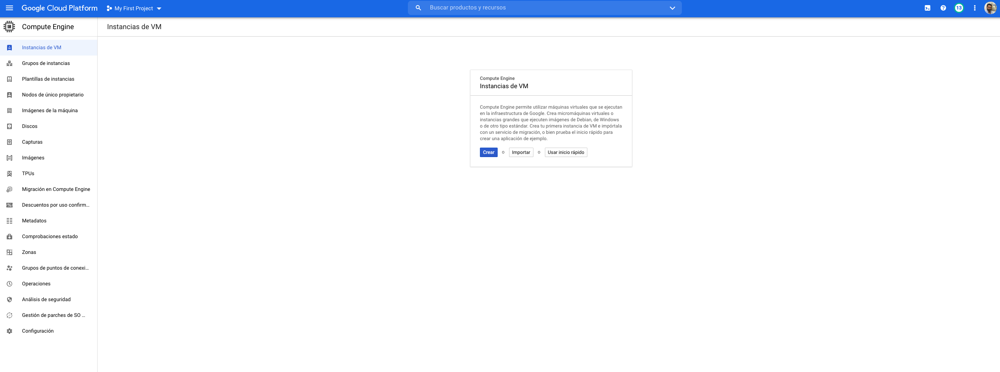
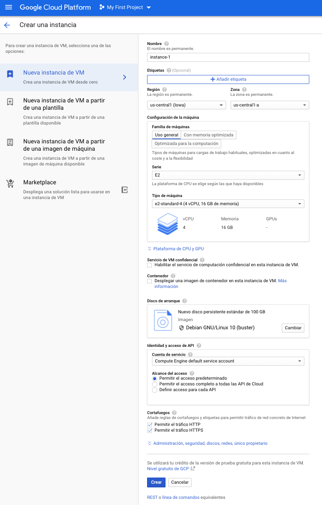
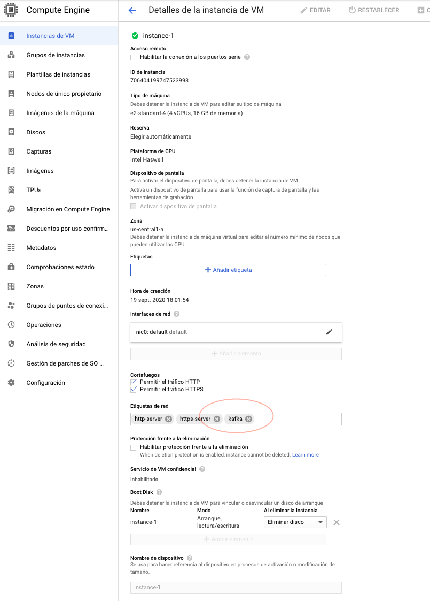

### [back](./project.md)

# Google Compute Instance Setup Guide

En esta guía vamos a crear una instancia en Google Compute Engine y configurar con el software necesario para nuestro sistema de recolección de datos en tiempo real.

## Crear instancia en google compute engine

Accedemos a [Google Compute Engine](https://console.cloud.google.com/compute/instances) y creamos una nueva instancia:

Configurando:
* Tipo de maquina: `e2-standard-4`
* Debian GNU/Linux 10: 100GB de disco persistente
* Permitir el tráfico HTTP & HTTPS



Una vez tenemos la instancia creada, podemos acceder a ella (usando una conexión SSH) utilizando la propia consola de google:


Una vez dentro del servidor, vamos a comenzar a configurar nuestro servidor debian en un sistema de recolección de datos.

## Configurar instancía de debian
1. Vamos a realizar todas las operaciones con el usuario root del sistema:
    ```bash
    sudo -i
    ```
* **NOTA:** En un entorno de producción no es recomendable ejecutar los servicios como superusuario, ya que puede ocasionar brechas de seguridad. Normalmente se crea un servicio por usuario para restringir el acceso.

2. En primer lugar vamos a actualizar el sistema de repositorios:
    ```bash
    apt-get update -y
    ```
3. Seguidamente vamos a instalar java y wget en nuestro sistema:
    ```bash
    apt-get install default-jre wget -y
    ```

    Podemos comprobarlo mediante:
    ```bash
    java -version
    ```
4. Una vez tenemos instalado Java, vamos a descargar la ultima versión de Apache Kafka y a descomprimir su contenido:
    ```bash
    wget http://apache.uvigo.es/kafka/2.6.0/kafka_2.12-2.6.0.tgz && tar -xvf kafka_2.12-2.6.0.tgz
    ```
    Podemos comprobar haciendo un `ls`:
    ```shell
    root@instance-1:~# ls
    kafka_2.12-2.6.0  kafka_2.12-2.6.0.tgz
    ``` 
5. Antes de ejecutar Kafka, también vamos a instalar docker, ya que el simulador de mensajes  será un docker que se conectara a Kafka y enviara los mensajes de los dispositivos y antenas.
    ```bash
    apt-get install \
    apt-transport-https \
    ca-certificates \
    curl \
    gnupg-agent \
    software-properties-common -y
    ```
    ```bash
    curl -fsSL https://download.docker.com/linux/debian/gpg | sudo apt-key add -
    ```
    ```bash
    add-apt-repository \
   "deb [arch=amd64] https://download.docker.com/linux/debian \
   $(lsb_release -cs) \
   stable"
   ```
   ```bash
   apt-get update -y
   ```
   ```bash
   apt-get install docker-ce docker-ce-cli containerd.io -y
   ```

   Para comprobar la instalación podemos hacer un `docker run hello-world` y veremos algo como lo siguiente:
   ```shell
   root@instance-1:~# docker run hello-world
    Unable to find image 'hello-world:latest' locally
    latest: Pulling from library/hello-world
    0e03bdcc26d7: Pull complete 
    Digest: sha256:4cf9c47f86df71d48364001ede3a4fcd85ae80ce02ebad74156906caff5378bc
    Status: Downloaded newer image for hello-world:latest
    Hello from Docker!
    This message shows that your installation appears to be working correctly.
    To generate this message, Docker took the following steps:
    1. The Docker client contacted the Docker daemon.
    2. The Docker daemon pulled the "hello-world" image from the Docker Hub.
        (amd64)
    3. The Docker daemon created a new container from that image which runs the
        executable that produces the output you are currently reading.
    4. The Docker daemon streamed that output to the Docker client, which sent it
        to your terminal.
    To try something more ambitious, you can run an Ubuntu container with:
    $ docker run -it ubuntu bash
    Share images, automate workflows, and more with a free Docker ID:
    https://hub.docker.com/
    For more examples and ideas, visit:
    https://docs.docker.com/get-started/

   ```

## Ejecutar Apache Kafka

1. En primer lugar vamos a entrar dentro de la distribución de Kafka que deberiamos de tener en `/root/kafka_2.12-2.6.0`:
    ```bash
    cd /root/kafka_2.12-2.6.0
    ```
2. Una vez estamos dentro vamos a ejecutar Apache Zookeeper, es una dependencia que utiliza Apache Kafka para su gestión y almacenamiento de configuraciones distribuidas.
    ```bash
    /root/kafka_2.12-2.6.0/bin/zookeeper-server-start.sh -daemon /root/kafka_2.12-2.6.0/config/zookeeper.properties
    ```
3. Antes de configurar Kafka, tenemos que hacer un pequeño cambio en su fichero de configuración, abrimos el fichero de configuración dentro de `/root/kafka_2.12-2.6.0/config/server.properties`, con el editor de texto preferido: `vim`, `nano`, etc.

    Buscamos la linea `#advertised.listeners=PLAINTEXT://your.host.name:9092` y la descomentamos cambiando la cadena `your.host.name` por la dirección IP pública de nuestra instancia.
    
    Esto permitira que podamos enviar y consumir mensajes desde un sistema externo.

    **NOTA:** Cada vez que apagamos y encedemos la instancía, la dirección IP pública puede cambiar, por lo que tendremos que volver a modificar este fichero, es recomendable apagar kafka y zookeeper antes de apagar la instancia de google.
    ```bash
    /root/kafka_2.12-2.6.0/bin/kafka-server-stop.sh
    ```
    ```bash
    /root/kafka_2.12-2.6.0/bin/zookeeper-server-stop.sh
    ```

4. Una vez modificado el fichero de propiedades, podemos iniciar el broker de kafka:
    ```bash
    /root/kafka_2.12-2.6.0/bin/kafka-server-start.sh -daemon /root/kafka_2.12-2.6.0/config/server.properties 
    ```
5. Si todo esta funcionando correctamente, si ejecutamos el siguiente comando: `ps aux | grep -v grep| grep kafka | wc -l`, debería de devolvernos un `2`. Si no es el caso, podemos intentar ejecutar el servicios de zookeeper y kafka sin el flag `daemon`, abriendo más una conexión a la instancia y poder ver el error generado, o consultar los ficheros de logs en: `/root/kafka_2.12-2.6.0/logs/`.

6. Cuando tenemos funcionando nuestro broker de kafka que escucha en el puerto TCP 9092, tenemos que permitir el tráfico entrante en la instancia VM, para eso vamos a crear una regla de cortafuegos que permita la conexión desde cualquier sitio al puerto 9092.
    ```bash
    gcloud compute --project=${PROJECT_ID} firewall-rules create kafka --direction=INGRESS --priority=1000 --network=default --action=ALLOW --rules=tcp:9092 --source-ranges=0.0.0.0/0 --target-tags=kafka
    ```
    Este comando tenemos que ejecutarlo en la cloud shell de google y configurar la variable PROJECT_ID, con el ID de nuestro proyecto.

7. Una vez creada la regla del firewall, tenemos que añadir la etiqueta `kafka` como etiqueta de red, en nuestra instancia, para ello vamos a google compute engine, editamos nuestra instancia y añadimos la etiqueta `kafka` y guardamos.
    

Una vez terminados estos pasos ya tenemos nuestro servidor de Kafka funcionando y aceptado tráfico externo. A continuación vamos a crear los topics donde recibiremos los datos de entrada:

```bash
/root/kafka_2.12-2.6.0/bin/kafka-topics.sh --create --partitions 4 --replication-factor 1 --zookeeper localhost:2181 --topic devices
```

```bash
/root/kafka_2.12-2.6.0/bin/kafka-topics.sh --create --partitions 4 --replication-factor 1 --zookeeper localhost:2181 --topic antenna_telemetry
```

### [back](./project.md)